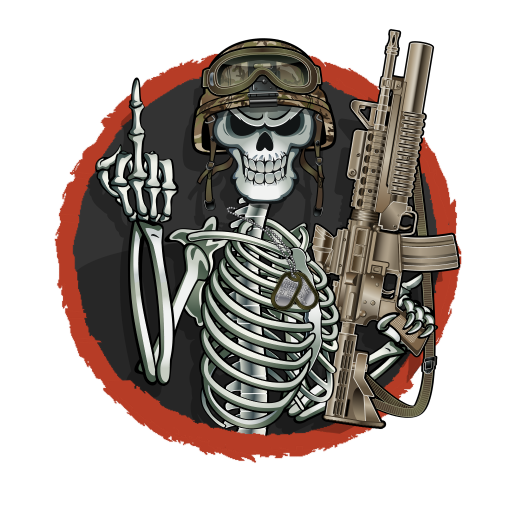

    

    
    
    
    

    <strong>Requires the latest version of <a href="https://github.com/CBATeam/CBA_A3/releases">CBA A3</a> and <a href="https://github.com/acemod/ACE3/releases">ACE3</a>. </strong>

# Ghost Custom Mission Template

##Its based on, and inspired by the following projects

- https://github.com/TaskForceDingo/Mission-Framework  -- TaskForceDingo -- 
- https://github.com/7Cav/cScripts -- 7CAV --   GNU GENERAL PUBLIC LICENSE
- https://github.com/DreadPirateAU/JEBUS -- Jebus -- Just Editor Based Unit Spawning -- MIT License
- https://github.com/genesis92x/VcomAI-3.0 -- VCOM -- 
- https://github.com/DerZade/BackpackOnChest -- Zade Backpack on chest --

All the code in this mod is available in the Github
you can find the Ghosts of Battle Version at https://github.com/ghosts-of-battle/mission_template

Huge appreciation and thanks to [ACE3 Team](http://ace3mod.com/team.html) for their open-source nature and permission to use their systems.

# License
This work uses the license Arma Public License Share Alike [Arma Public License Share Alike (APL-SA)](https://www.bohemia.net/community/licenses/arma-public-license-share-alike)

You can freely modify, copy, "cannibalize", to use in your projects.

# Rules
This template is very simple to use, just follow these simple rules
1. If you do not know what your doing do not edit anyfile outside of the edit_me folder

2. If you think you know what your doing , you break it you buy it

# Howto's

## Files
- edit_me\ADMINLIST.hpp - access to the in mission admin panel (the pause key by default)
- edit_me\approvedMods.hpp - A list of mods, a mod not on the list will only report the mod in the log, will not stop playing the mission
- edit_me\arsenal_import.sqf - sets the in mission arsenal , edit the lines between the []'s, if you export from 3den an ace arsenal its the required format 
- edit_me\description.ext - edit who can edit cba settings , and who can use the debug console 
- edit_me\init.sqf - a few mission settings 
- edit_me\staticData.sqf - some alive mission settings

